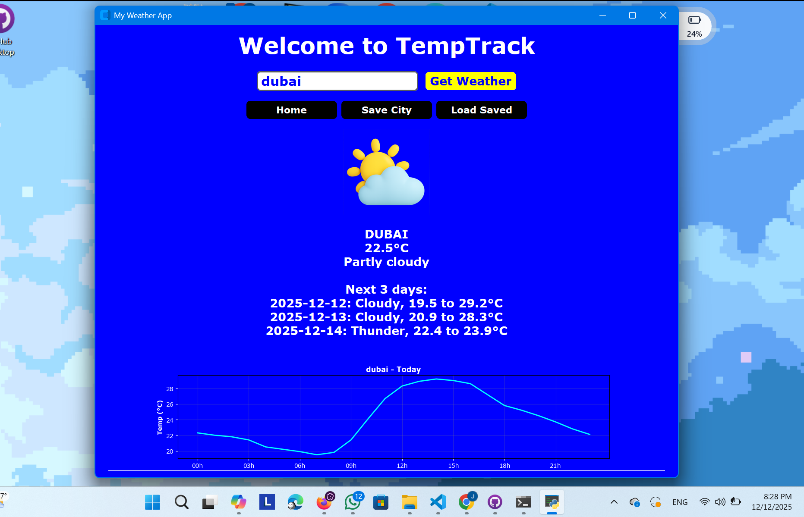

# 🌤️ TempTrack - Python Weather App

[]()
[]()
[]()
[]()
[]()

<p align="center">
  <b>A modern desktop weather app with real-time conditions, forecasts & beautiful data visualization</b>
</p>



---

## ✨ Features

| Feature | Description |
|---------|-------------|
| 🌍 **Real-Time Weather** | Live conditions via Open-Meteo API (no API key needed) |
| 📅 **3-Day Forecast** | Extended weather predictions at a glance |
| 📈 **Hourly Trends** | Matplotlib-powered temperature charts |
| 🎨 **Modern UI** | Sleek CustomTkinter interface with dark/light modes |
| 🖼️ **Dynamic Icons** | Weather-specific icons with emoji fallback |
| 💾 **City Saving** | Personalized tracking with persistent preferences |
| ⚡ **Lightweight** | Fast, minimal resource usage |

---

## 🚀 Quick Start

### Prerequisites
- Python 3.8+
- pip package manager

### Installation

```bash
# Clone the repository
git clone https://github.com/jomanamostafa/TempTrack-python-weather-app.git
cd TempTrack-python-weather-app

# Install dependencies
pip install -r requirements.txt

# Run the app
python weatherfinal.py
```

---

## 📁 Project Structure

```
TempTrack-python-weather-app/
├── 📂 images/              # Weather icons (PNG/SVG)
│   ├── clear.png
│   ├── cloudy.png
│   ├── rain.png
│   └── ...
├── 📄 my_city.txt          # Default city preference
├── 📄 preferences.json     # User configuration settings
├── 📄 weatherfinal.py      # Main application entry point
├── 📄 requirements.txt     # Python dependencies
└── 📄 LICENSE              # MIT License
```

---

## ⚙️ Configuration

### Set Your City
Edit `my_city.txt`:
```
London
```

Or customize via `preferences.json`:
```json
{
  "city": "London",
  "units": "metric",
  "theme": "dark",
  "show_forecast": true
}
```

---

## 🛠️ Tech Stack

- **GUI**: [CustomTkinter](https://github.com/TomSchimansky/CustomTkinter) - Modern tkinter widgets
- **Charts**: [Matplotlib](https://matplotlib.org/) - Data visualization
- **API**: [Open-Meteo](https://open-meteo.com/) - Free weather data (no key required)
- **Icons**: Dynamic PNGs with emoji fallback ⚡

---

## 📸 Screenshots

| Main Interface | Forecast View | Hourly Chart |
|:--:|:--:|:--:|
|  |  |  |

---

## 🎯 Future Roadmap

- [ ] 7-day extended forecast
- [ ] GPS auto-location detection
- [ ] Multiple city tracking
- [ ] Weather alerts & notifications
- [ ] Export data to CSV
- [ ] Unit switching (°C/°F)
- [ ] Background location sync

---

## 🤝 Contributing

Contributions are welcome! Please feel free to submit a Pull Request.

1. Fork the project
2. Create your feature branch (`git checkout -b feature/AmazingFeature`)
3. Commit your changes (`git commit -m 'Add some AmazingFeature'`)
4. Push to the branch (`git push origin feature/AmazingFeature`)
5. Open a Pull Request

---

## 📝 License

Distributed under the **MIT License**. See [`LICENSE`](LICENSE) for more information.

---

## 👩‍💻 Author

**Jomana Mostafa**

[](https://github.com/jomanamostafa)
[](https://www.linkedin.com/in/jomana-mostafa/)

---

<p align="center">
  Made with ❤️ in Python | ⭐ Star this repo if you find it useful!
</p>
```

---

## 📄 requirements.txt

```txt
# Core GUI framework
customtkinter>=5.0.0

# Data visualization
matplotlib>=3.5.0

# API requests
requests>=2.28.0

# Image handling
Pillow>=9.0.0

# Date/time utilities
python-dateutil>=2.8.0
```
## Demo

Here’s how TempTrack looks when running:


